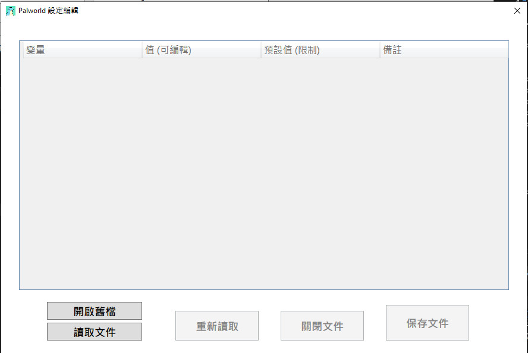
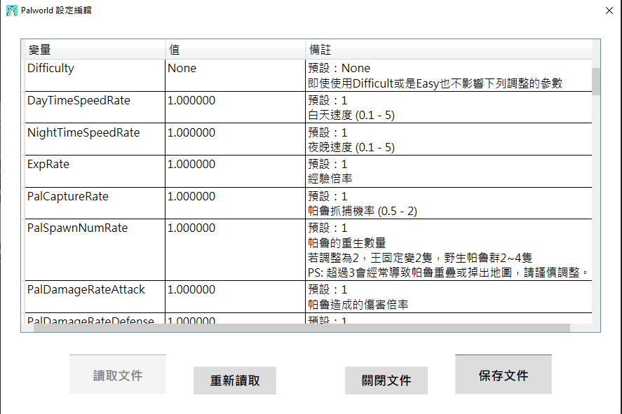

# Palworld Server Setting Editor

# [README (English)](./README_EN.md)

### 為了讓自己方便修改設定所製作，可能有些代碼不太友好

### 需要請自取, 當然我不能保證不會有錯誤, 目前自己測試是正常的

### [發布 (Releases)](https://github.com/murayuki/PalWorld-SettingTools/releases)

# 功能特點

- **A01:**
  
  - **如果是需要英文備註請將 `Remark_EN.json` 重新命名為 `Remark.json`**
  
  - `Remark_EN.json` 翻譯來自 ``ChatGPT``

- **A02:**
  
  - ~~**程式中的語言為 `繁體中文`**~~
  
  - ~~**如果需要英文請自行建構 `EXE執行文件` 需要對 C# 有基本能力以及 Visual Studio 的基本操作 (開發使用 2022)**~~
  
  - **請自行選擇語言文件 `I18n.json`/`I18n_EN.json`**
  
  - **如果沒有請自行翻譯只要檔案名稱是 `I18n.json` 即可**
* ### **GUI 直覺 編輯設定文件**

* ### **GUI 將變量備註**

* 

* ### 圖片功能介紹
  
  - ##### **(1) 數值編輯框**
  
  - ##### **(2) 讀取文件 (請直接選擇 `PalWorldSettings.ini` 所在目錄即可自動獲取)**
  
  - ##### **(3) 已讀取文件狀態, 如果編輯錯誤可以直接重新讀取原數值**
  
  - ##### **(4) 關閉文件 (不保存)**
  
  - ##### **(5) 保存文件並關閉文件**

# 圖片介紹

# 資料來源

#### **關於 `Remark.json`文件中的備註資料下列**

- [Palworld tech guide - Optimize game balance (palworldgame.com)](https://tech.palworldgame.com/optimize-game-balance)

- [【討論】伺服器參數難度調整分享 @幻獸帕魯 哈啦板 - 巴哈姆特 (gamer.com.tw)](https://forum.gamer.com.tw/C.php?bsn=71458&snA=227)
