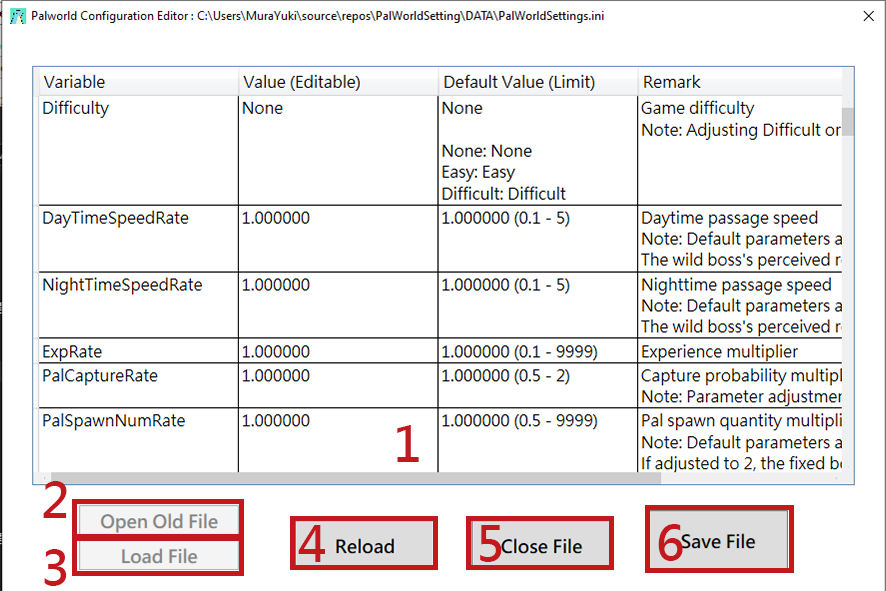
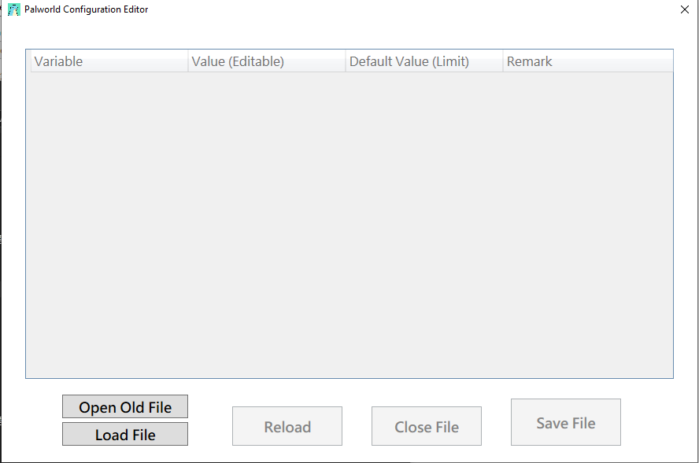
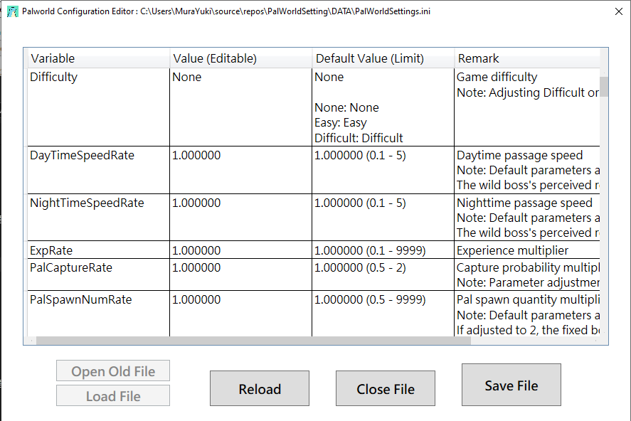

# Palworld Server Setting Editor

### Created for the convenience of modifying settings, some code may not be very user-friendly.

### Please use at your own discretion. Of course, I cannot guarantee that there will be no errors. It is currently tested and working fine for me.

### [Releases](https://github.com/murayuki/PalWorld-SettingTools/releases)

# Important Notes

> All translations with `_EN` in the `json` files are from `ChatGPT`.

- **A01:**
  
  - **If English remarks are needed, please rename `Remark_EN.json` to `Remark.json`.**

- **A02:**
  
  - **Please select the language file `I18n.json`/`I18n_EN.json` yourself.**
  
  - **If not, please translate it on your own, and make sure the file name is `I18n.json`.**

# Features

* **Intuitively edit configuration files using a GUI.**

* ### **GUI includes variable remarks.**

* 

* ### Image Feature Overview
  
  - ##### **(1) Numeric input box**
  
  - ##### **(2) Load File (Please select the directory where `PalWorldSettings.ini` is located, and it will automatically fetch)**
  
  - ##### **(3) Status of the loaded file. If edited incorrectly, you can reload the original values.**
  
  - ##### **(4) Close the file (without saving)**
  
  - ##### **(5) Save the file and close**

# Image Preview

# Data Sources

#### **Regarding the remarks data in the `Remark.json` file:**

- [Palworld tech guide - Optimize game balance (palworldgame.com)](https://tech.palworldgame.com/optimize-game-balance)

- [【Discussion】Server parameter difficulty adjustment sharing @Palworld Forum - 巴哈姆特 (gamer.com.tw)](https://forum.gamer.com.tw/C.php?bsn=71458&snA=227)
  
  - **Special thanks to [DANIEL6505](https://home.gamer.com.tw/daniel6505), a user on the Bahamut forum, for sharing and organizing information and testing. Note: For more detailed explanations, you can refer to this article.**
